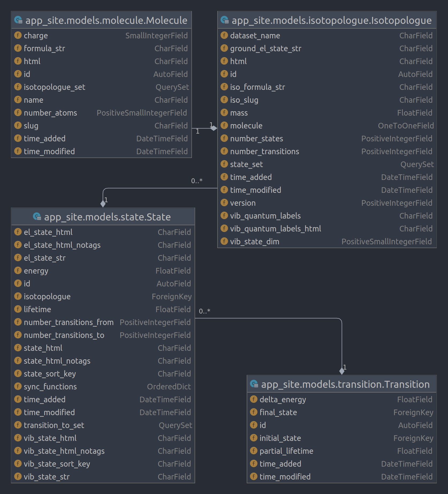

***********************
LIDA Lifetimes Database
***********************

This is a Django web project for the LIDA database in development. This documentation
file is aimed solely at future developer of the project and it should compile some
useful information about the project, brief description of the project structure, the
data model, known issues with the project so far, and finally the plans for the future.

The documentation also expects a reasonable well knowledge of python and django.
Good python knowledge is essential, while regarding Django, the knowledge level required
is not really above the level of the official Django tutorial.

Getting started
===============

- Prepare a clean python virtual environment (the project has so far been developed and
  tested on Python 3.8)

- Clone the package: ``git clone git@github.com:ExoMol/lida-web.git``

- Install the dependencies: ``pip install -r requirements.txt``

- Create a new SQL database on your local system, I've been using MySQL, but other
  databases are possible (just the *local settings* file must be tweaked). This needs
  the database server to be running on your local system.

- Create the ``lida/lida/local_settings.py`` file with the local settings - these are
  all the local-development-only and sensitive settings, which should not be part
  of the version control system. This is what my own ``local_settings.py`` file looks
  like this (don't forget to update all relevant data):

  .. code-block:: python

    import sys

    # Quick-start development settings - unsuitable for production
    # See https://docs.djangoproject.com/en/3.2/howto/deployment/checklist/

    # SECURITY WARNING: keep the secret key used in production secret!
    SECRET_KEY = 'some random string, this is only crucial for production server'

    # SECURITY WARNING: don't run with debug turned on in production!
    DEBUG = True

    # Database
    # https://docs.djangoproject.com/en/3.2/ref/settings/#databases
    # noinspection PyUnresolvedReferences
    DATABASES = {
        'default': {
            'ENGINE': 'django.db.backends.mysql',  # for MySQL option
            'NAME': 'lida',  # corresponds to the database running on local
            'USER': 'name',  # corresponds to the database running on local
            'PASSWORD': 'password',  # corresponds to the database running on local
            'HOST': 'localhost',
            'PORT': '3306',
        }
    }

    if 'test' in sys.argv:
        # I have experienced that sqlite backend was considerably faster when running
        # unit tests, to whenever `manage.py` is run with 'test' argument, backend
        # changes to sqlite
        DATABASES['default'] = {
            'ENGINE': 'django.db.backends.sqlite3',
            # 'NAME': str(Path(__file__).resolve().parent.parent / 'test_db.sqlite'),
        }

- Run the tests to see if all works: from within the top-level ``lida`` directory (and
  the virtual environment), run ``python manage.py test``

- Run the migrations to bring your local SQL database in sync with the LIDA data model:
  ``python manage.py migrate``

- See if the local development server can be started: ``python manage.py runserver``.
  If all is ok, there should be a functioning website running at ``localhost``, albeit
  without any data.

- I have already generated some portion of the LIDA data and populated them in my local
  copy. The data are way too big to be included in version control. The MySQL dump file
  will be shared outside this package and it can be loaded into the running MySQL
  database. If everything goes well, this should sync the data content of this project
  on the local system of any future developer with my last state of the project.

Project structure
=================

The ``lida-web`` project follows a fairly standard django structure. The project
settings and the highest-level url mappings are located in the ``lida`` package.

Than we have two django apps: ``app_site`` and ``app_api``.

The ``app_site`` is pretty much everything to do with the website frontend, backend etc,
concerning browsing the data.

The ``app_api`` is at this moment not really present (apart from the skeleton) and is
designed to handle the data requesting API in the future. The *About API* page template
and view are also part of the ``app_api`` app.

Then there is the top-level template in the ``templates`` folder, which is used as a
base for all the templates defined in the apps, the ``static`` folder with static files
such as the favicon, logos, other images, etc, the page-level css file, and the
bootstrap and datatables libraries (css and javascript)

Finally there is the ``res`` folder, containing some top level scripts (more about those
further on).

Note on the *datatables* library
--------------------------------

The LIDA data are served in interactive data tables, supporting stuff such as filtering,
sorting, dynamic *as-scroll* data rendering, etc. This is a fairly well known javascript
and JQuery `library <https://datatables.net/>`_.
As the amount of data (states or transitions) per each molecule is very high, the
datatables must be run in the server-side mode, where the table itself does not tap
directly to the data, but rather user interaction with it creates ajax requests, which
are intercepted by the django backend and based on those, the data are requested from
the underlying database and served up back to the datatables, which then serve the data.

This happens any time user interacts with the table, so any scrolling, pagination
change, new filtering string, or any column sorting click. All these actions create
a request over a particular URL, which results in one of the
``app_site.views.views_ajax`` Django views to serve the correct data from the database
to the actual html view.

The data serving is handled by the
`django-datatables-serverside <https://github.com/hanicinecm/django-datatables-serverside>`_,
package (also ``pip`` installable), which has been
written by me purposefully for this project. Unfortunately, this package is not yet
at all documented, but hopefully I'll get back to it. If there are any questions, I'm
happy to provide guidance.

Data model
==========

The current data model of the web project can be seen on the following
*Django Model Dependency Diagram*:

Top-level scripts
=================

Known issues
============

To be included.

Future work suggestions
=======================

To be included.
